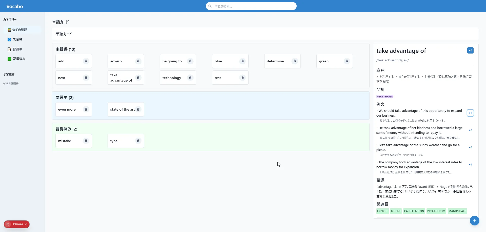
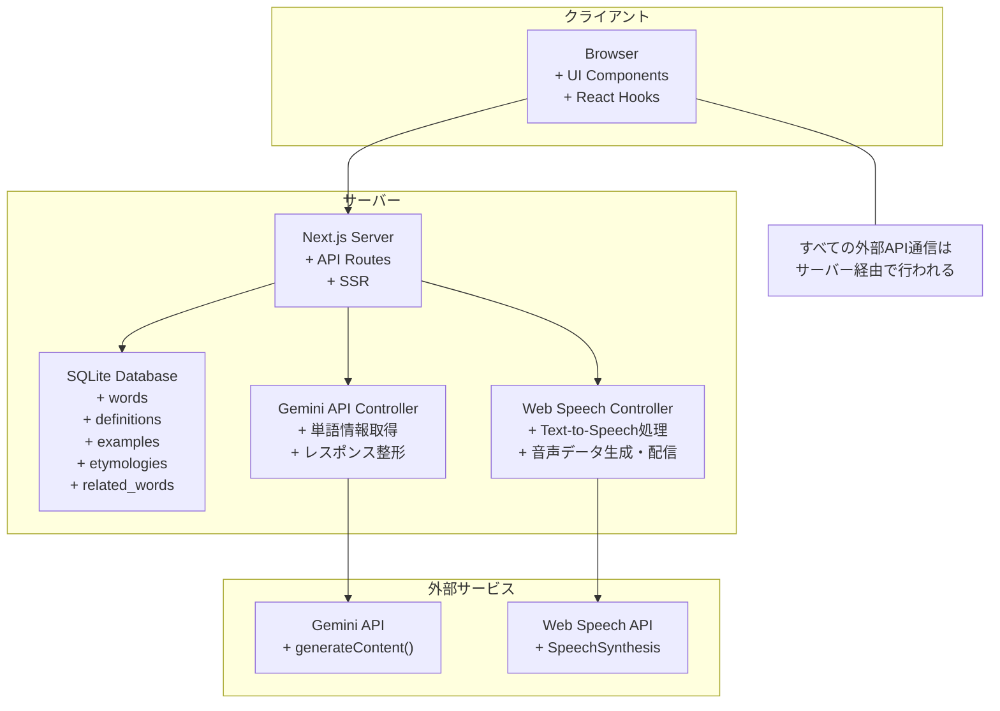
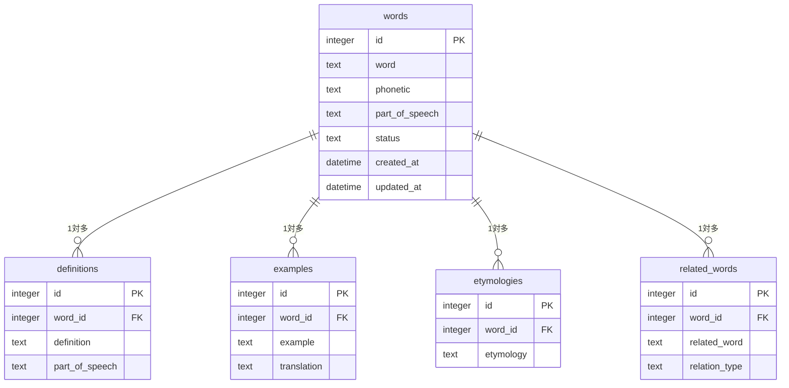
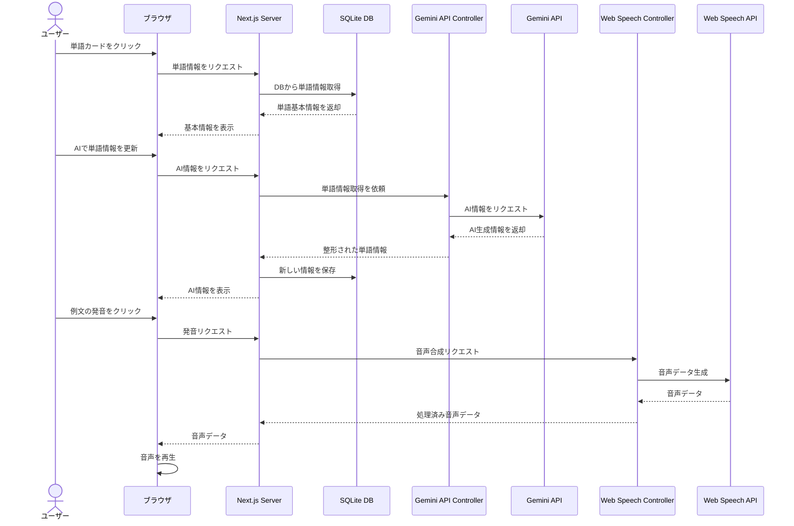
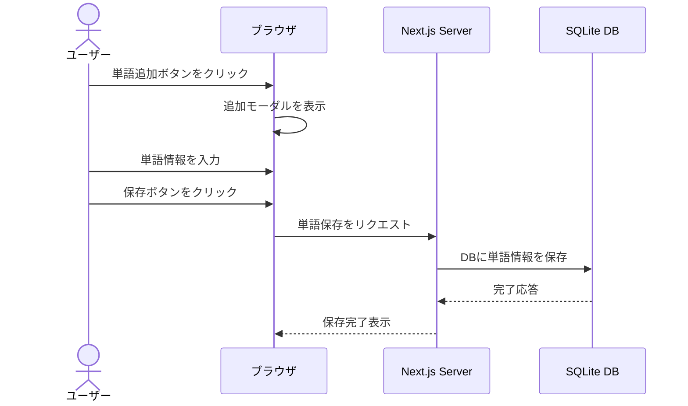
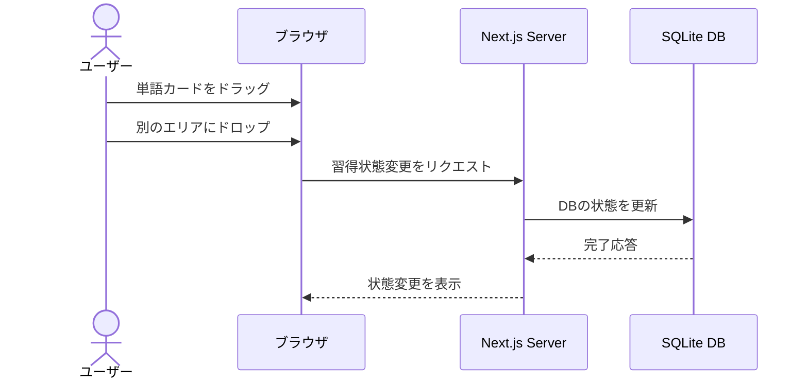
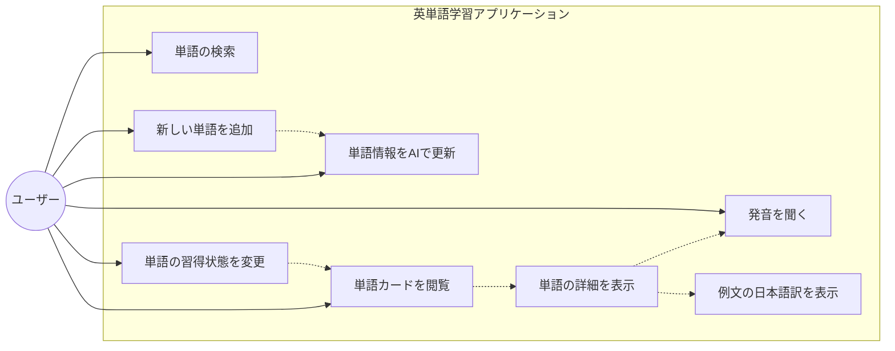

# 英単語学習アプリケーション

英単語の学習をサポートするためのインタラクティブなウェブアプリケーションです。単語の追加、意味や例文の自動取得、発音機能、学習進捗の管理などを行うことができます。
<p align="center">
  
</p>


## 主な機能

- **単語カード管理**: 単語と関連情報をカード形式で表示・管理
- **自動情報取得**: Gemini APIを使用して単語の意味、例文、語源を自動取得
- **ネイティブ発音**: 英語ネイティブの発音で単語や例文を聞くことができる機能
- **進捗管理**: ドラッグ＆ドロップで単語の学習状態を管理（未習得、学習中、習得済み）
- **例文の日本語訳表示**: 例文とその日本語訳を表示
- **システム構成**: SQLiteデータベースによる永続化

## 技術スタック

- **フロントエンド**: Next.js, React, TypeScript, Chakra UI
- **バックエンド**: Next.js API Routes
- **データベース**: SQLite
- **AI API**: Google Gemini API（単語情報の自動取得）
- **音声API**: Web Speech API（音声合成）

## システム構成図（Mermaid）



## データベースER図（Mermaid）



## シーケンス図（Mermaid）

### 1. 単語情報の取得と表示



### 2. 単語の追加プロセス



### 3. 習得状態の変更プロセス



## ユースケース図（Mermaid）



## インストール方法

### 前提条件

- Node.js 18.x以上
- npm 9.x以上

### インストール手順

1. リポジトリをクローンする
```bash
git clone https://github.com/yourusername/vocabulary-app.git
cd vocabulary-app
```

2. 依存パッケージをインストールする
```bash
npm install
```

3. 環境変数の設定
```bash
# .env.local ファイルを作成
NEXT_PUBLIC_GEMINI_API_KEY=あなたのGemini APIキー
```

4. データベースの初期化
```bash
node server/database.js
```

5. アプリケーションの起動
```bash
npm run dev
```

## 使用方法

- **単語の追加**: 「+」ボタンをクリックしてモーダルを開き、単語情報を入力して保存します。
- **単語のブラウズ**: 未習得、習得中、習得済みの各エリアで単語カードを確認できます。
- **単語の発音**: 単語カードや例文の横にある音声アイコンをクリックすると発音が再生されます。
- **AI情報の取得**: 単語詳細画面で「AIで単語情報を更新」ボタンをクリックすると、Gemini APIから最新の情報を取得できます。
- **習得状態の変更**: 単語カードをドラッグして別のエリアにドロップすると、習得状態が変更されます。

## ライセンス

MIT
