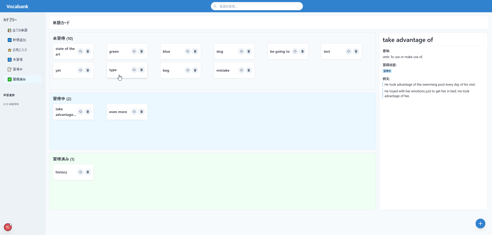

# 英単語学習アプリケーション

英単語の学習をサポートするためのインタラクティブなウェブアプリケーションです。単語の追加、意味や例文の自動取得、発音機能、学習進捗の管理などを行うことができます。

<p align="center">
  
</p>

## 主な機能

- **単語カード管理**: 単語と関連情報をカード形式で表示・管理
- **自動情報取得**: 辞書APIを使用して単語の意味、例文、語源を自動取得
- **ネイティブ発音**: 英語ネイティブの発音で単語を聞くことができる機能
- **進捗管理**: ドラッグ＆ドロップで単語の学習状態を管理（未習得、学習中、習得済み）
- **削除機能**: 不要になった単語カードを削除可能

## 技術スタック

- **フロントエンド**: Next.js, React, TypeScript, Chakra UI
- **バックエンド**: Node.js, Express
- **API**: 外部辞書API (Free Dictionary API)、ローカル音声合成API
- **状態管理**: React Hooks, ローカルストレージ
- **スタイリング**: Chakra UI

## インストール方法

### 前提条件

- Node.js 18.x以上
- npm 9.x以上

### インストール手順

1. リポジトリをクローンする
```bash
git clone https://github.com/yourusername/vocabulary-app.git
cd vocabulary-app
```

2. 依存パッケージをインストールする
```bash
# フロントエンド（メインアプリ）の依存パッケージ
npm install

# 音声サーバーの依存パッケージ
cd server
npm install
cd ..
```

## 使用方法

### アプリケーションの起動

1. メインアプリケーションを起動する
```bash
npm run dev
```

2. 音声APIサーバーを起動する（別ターミナルで）
```bash
cd server
npm start
```

3. ブラウザで [http://localhost:3000](http://localhost:3000) にアクセスする

### 基本操作

- **単語の追加**: 「新しい単語」フィールドに単語を入力して「追加」ボタンをクリックすると、意味、例文、語源が自動的に取得され、単語カードが作成されます。
- **単語の発音**: 単語カードの音声アイコンをクリックすると、英語ネイティブの発音で単語を聞くことができます。
- **進捗管理**: 単語カードをドラッグして「未習得」「学習中」「習得済み」の各コンテナに移動することで、学習進捗を管理できます。
- **詳細表示**: 単語カードの下部にある展開アイコンをクリックすると、例文、語源、関連語などの詳細情報が表示されます。
- **単語の削除**: 単語カードの右上にある削除アイコンをクリックすると、単語を削除できます。削除前に確認ダイアログが表示されます。

## プロジェクト構造

```
vocabulary-app/
├── app/                  # Next.jsアプリケーション
│   ├── components/       # Reactコンポーネント
│   ├── models/           # 型定義
│   ├── utils/            # ユーティリティ関数
│   ├── page.tsx          # メインページ
│   └── providers.tsx     # プロバイダー設定
├── public/               # 静的ファイル
├── server/               # 音声APIサーバー
│   ├── api.js            # 音声API実装
│   ├── audio/            # 生成された音声ファイル
│   └── package.json      # サーバー用依存パッケージ
└── package.json          # メインアプリ用依存パッケージ
```

## カスタマイズ方法

### 辞書API

現在は [Free Dictionary API](https://dictionaryapi.dev/) を使用しています。他の辞書APIを使用する場合は、`app/utils/wordGenerator.ts` の `fetchWordInfo` 関数を変更してください。

### 音声エンジン

デフォルトではブラウザの音声合成APIをフォールバックとして使用していますが、実際の音声エンジンを使用する場合は、`server/api.js` の `generateSpeech` 関数内の `useMockEngine` を `false` に設定し、適切なコマンドを設定してください。

### 対応している音声エンジン（サンプル）

- Google Text-to-Speech
- Amazon Polly
- eSpeak

## トラブルシューティング

- **単語情報が取得できない**: インターネット接続を確認してください。APIがレート制限を超えている可能性もあります。
- **音声が再生されない**: 音声APIサーバーが起動しているか確認してください。ブラウザが音声合成APIをサポートしていない場合、音声再生に失敗することがあります。
- **ドラッグ＆ドロップが動作しない**: ブラウザがHTML5のドラッグ＆ドロップAPIをサポートしていることを確認してください。

## ライセンス

MIT
